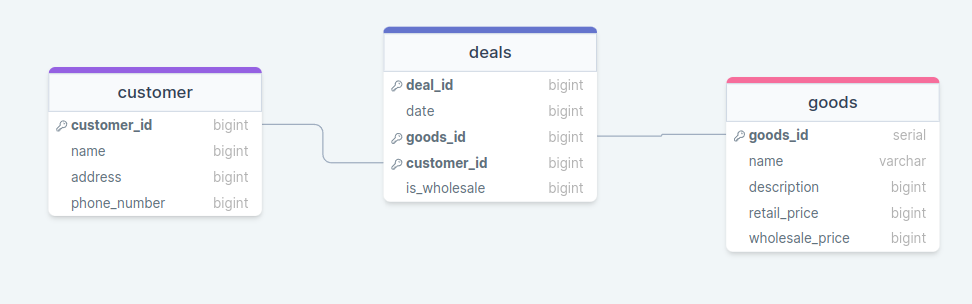
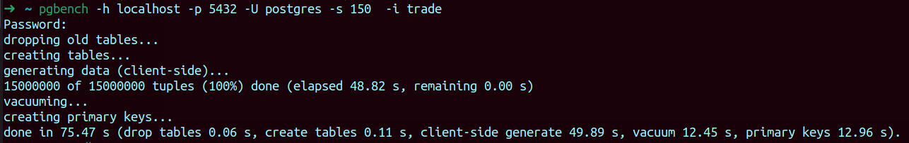
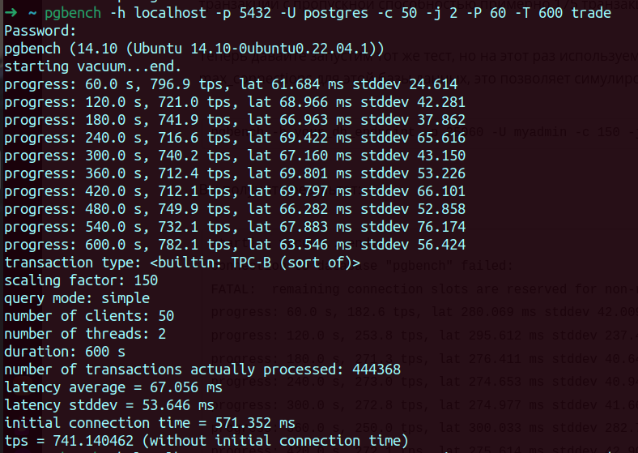
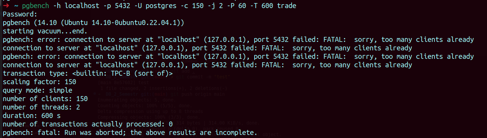
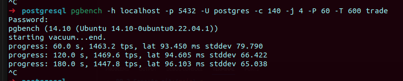
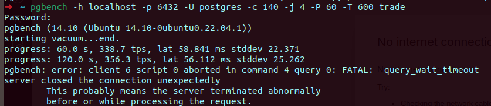
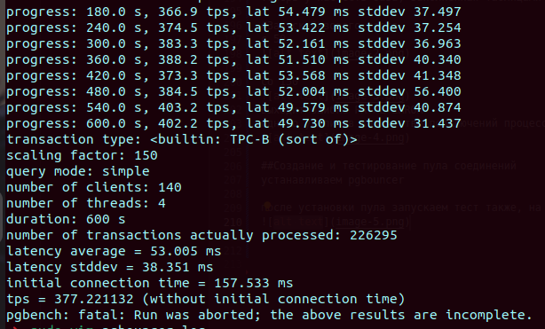

###Лабораторная 1
##Цель: Провести оценку производитеьлности с помощью PGBENCH
#Концептуальный вид бд


#физическая модель:
```sql
create table customers(
	customer_id serial primary key,
	name varchar,
	address varchar,
	phone_number varchar
);

create table goods(
	goods_id serial primary key,
	name varchar,
	description varchar,
	retail_price float,
	wholesale_price float
);

create table deals(
	id serial primary key,
	customer_id int references customers.customer_id,
	goods_id int references goods.goods_id,
	quantity int check( quantity > 0),
	date date,
	is_wholesale bool
);
```

1) Заполняю данными от chatgpt
```sql

  ('Charlie Brown', '654 Pine St, CityE', '555-8765'),
  ('Laura Davis', '789 Birch St, CityF', '555-3456'),
  ('Michael Lee', '456 Cedar St, CityG', '555-7890'),
  ('Emma White', '789 Rose St, CityH', '555-2345'),
  ('David Jones', '123 Sun St, CityI', '555-6789'),
  ('Sophia Moore', '654 Moon St, CityJ', '555-0123'),
  ('Daniel Taylor', '321 Mars St, CityK', '555-3456'),
  ('Olivia Hall', '789 Jupiter St, CityL', '555-6789'),
  ('James Davis', '456 Saturn St, CityM', '555-0123'),
  ('Ava Miller', '789 Pluto St, CityN', '555-3456'),
  ('William Harris', '123 Neptune St, CityO', '555-6789'),
  ('Ella Anderson', '654 Uranus St, CityP', '555-0123'),
  ('Alexander Martin', '321 Venus St, CityQ', '555-3456'),
  ('Grace Moore', '789 Earth St, CityR', '555-6789'),
  ('Henry Smith', '456 Mercury St, CityS', '555-0123'),
  ('Liam Davis', '789 Galaxy St, CityU', '555-3456'),
  ('Emily Johnson', '987 Walnut St, CityG', '555-6789'),
  ('Michael Davis', '210 Pineapple St, CityH', '555-8901'),
  ('Sophia Wilson', '543 Cedar St, CityI', '555-2345'),
  ('Daniel Taylor', '876 Oakwood St, CityJ', '555-4567'),
  ('Olivia Moore', '109 Maple St, CityK', '555-7890'),
  ('Ethan White', '432 Birch St, CityL', '555-5678'),
    ('Sophie Johnson', '876 Oak St, CityT', '555-5432'),
  ('Carter Davis', '109 Pine St, CityU', '555-8765'),
  ('Mia Moore', '432 Elm St, CityV', '555-2109'),
  ('Samuel White', '789 Oakwood St, CityW', '555-5432'),
  ('Aria Martin', '543 Birch St, CityX', '555-8765'),
  ('Owen Smith', '876 Pineapple St, CityY', '555-2109'),
  ('Abigail Wilson', '109 Neptune St, CityZ', '555-5432'),
  ('Sebastian Taylor', '432 Uranus St, CityAA', '555-8765'),
  ('Scarlett Davis', '789 Venus St, CityBB', '555-2109'),
  ('Wyatt White', '543 Earth St, CityCC', '555-5432'),
  ('Zoe Smith', '876 Mercury St, CityDD', '555-8765'),
  ('Leo Moore', '109 Galaxy St, CityEE', '555-2109'),
  ('Grace Davis', '432 Walnut St, CityFF', '555-5432'),
  ('Logan Wilson', '789 Pineapple St, CityGG', '555-8765'),
  ('Lily Taylor', '109 Cedar St, CityHH', '555-2109');
 
 
 
 INSERT INTO goods (name, description, retail_price, wholesale_price) VALUES
  ('Laptop', 'High-performance laptop', 1200.00, 1000.00),
  ('Smartphone', 'Latest smartphone model', 800.00, 650.00),
  ('Tablet', '10-inch tablet', 300.00, 250.00),
  ('TV', '50-inch 4K TV', 1000.00, 800.00),
  ('Headphones', 'Wireless noise-canceling headphones', 150.00, 120.00),
  ('Coffee Maker', 'Programmable coffee maker', 50.00, 40.00),
  ('Blender', 'High-speed blender', 80.00, 65.00),
  ('Microwave', 'Countertop microwave oven', 120.00, 100.00),
  ('Vacuum Cleaner', 'Bagless upright vacuum cleaner', 200.00, 160.00),
  ('Toaster', '4-slice toaster', 40.00, 30.00),
  ('Refrigerator', 'French door refrigerator', 1200.00, 1000.00),
  ('Dishwasher', 'Built-in dishwasher', 500.00, 400.00),
  ('Washing Machine', 'Top-load washing machine', 600.00, 500.00),
  ('Dryer', 'Electric clothes dryer', 400.00, 320.00),
  ('Air Conditioner', 'Window air conditioner', 300.00, 250.00),
  ('Fan', 'Oscillating floor fan', 50.00, 40.00),
  ('Heater', 'Ceramic space heater', 80.00, 65.00),
  ('Blu-ray Player', '4K Ultra HD Blu-ray player', 150.00, 120.00),
  ('Game Console', 'Video game console', 400.00, 320.00),
  ('Digital Camera', 'Mirrorless digital camera', 800.00, 650.00),
    ('Digital Camera', '20MP high-res camera', 400.00, 320.00),
  ('Printer', 'Wireless color printer', 150.00, 120.00),
  ('External Hard Drive', '2TB USB 3.0 HDD', 80.00, 65.00),
  ('Desk Chair', 'Ergonomic office chair', 120.00, 100.00),
  ('Fitness Tracker', 'Waterproof fitness tracker', 50.00, 40.00),
  ('Bluetooth Speaker', 'Portable Bluetooth speaker', 30.00, 25.00),
   ('Monitor', '27-inch 4K IPS monitor', 300.00, 250.00),
  ('Gaming Laptop', 'Powerful gaming laptop', 1500.00, 1200.00),
  ('Printer', 'Wireless monochrome laser printer', 100.00, 80.00),
  ('Smartwatch', 'Fitness and health tracking smartwatch', 80.00, 65.00),
  ('Digital Camera', 'HD camcorder with image stabilization', 600.00, 500.00),
  ('Electric Toothbrush', 'Rechargeable electric toothbrush', 50.00, 40.00),
  ('Air Purifier', 'HEPA air purifier with ionizer', 120.00, 100.00),
  ('Soundbar', 'Wireless soundbar with subwoofer', 200.00, 160.00),
  ('Coffee Grinder', 'Burr coffee grinder with adjustable settings', 40.00, 30.00),
  ('Rice Cooker', 'Programmable rice cooker', 60.00, 50.00),
  ('Robot Vacuum', 'Smart robotic vacuum cleaner', 250.00, 200.00),
  ('Bluetooth Earbuds', 'Wireless Bluetooth earbuds', 40.00, 30.00),
  ('Wireless Mouse', 'Ergonomic wireless optical mouse', 20.00, 15.00),
  ('External SSD', '500GB USB-C external solid-state drive', 90.00, 75.00),
  ('Fitness Bike', 'Stationary fitness bike with LCD display', 300.00, 250.00),
  ('Gaming Mouse', 'RGB gaming mouse with customizable buttons', 50.00, 40.00),
  ('Smart Thermostat', 'Wi-Fi-enabled smart thermostat', 80.00, 65.00),
  ('Portable Charger', 'High-capacity portable phone charger', 30.00, 25.00),
  ('Desk Lamp', 'LED desk lamp with adjustable brightness', 25.00, 20.00),
  ('Cordless Drill', '18V cordless drill with accessories', 70.00, 55.00),
  ('Wireless Keyboard', 'Slim wireless keyboard with touchpad', 35.00, 28.00),
  ('Projector', '1080p home theater projector', 400.00, 320.00),
  ('Air Fryer', 'Digital air fryer with presets', 70.00, 55.00),
  ('Electric Kettle', 'Stainless steel electric kettle', 25.00, 20.00),
  ('Fitness Ball', 'Anti-burst exercise stability ball', 15.00, 12.00),
  ('Noise-Canceling Headphones', 'Over-ear Bluetooth headphones', 120.00, 100.00),
  ('Smart Doorbell', 'HD video doorbell with two-way audio', 90.00, 75.00),
  ('Instant Pot', '7-in-1 programmable multi-cooker', 80.00, 65.00),
    ('VR Headset', 'Virtual reality headset with motion tracking', 200.00, 160.00),
  ('Digital Watch', 'Smart digital watch with fitness tracking', 100.00, 80.00),
  ('Home Theater System', '5.1 surround sound home theater system', 500.00, 400.00),
  ('Robot Vacuum', 'Smart robotic vacuum cleaner with mapping', 300.00, 250.00),
  ('Gaming Laptop', 'High-performance gaming laptop', 1500.00, 1200.00),
  ('Wireless Router', 'Dual-band wireless router with high-speed connectivity', 80.00, 65.00),
  ('Bluetooth Earbuds', 'True wireless Bluetooth earbuds with noise cancellation', 120.00, 100.00),
  ('Smart Thermostat', 'Programmable smart thermostat for home heating/cooling', 70.00, 55.00),
  ('E-book Reader', 'E-ink display e-book reader with built-in light', 90.00, 75.00),
  ('Electric Scooter', 'Foldable electric scooter for commuting', 300.00, 250.00),
  ('Power Bank', 'High-capacity portable power bank', 40.00, 30.00),
  ('Security Camera', 'Wireless security camera system with night vision', 120.00, 100.00),
  ('Fitness Smartwatch', 'Water-resistant fitness smartwatch with heart rate monitor', 60.00, 50.00),
  ('Portable Projector', 'Mini portable projector for presentations and entertainment', 150.00, 120.00),
  ('Digital Photo Frame', 'Digital picture frame with slideshow feature', 50.00, 40.00);
  
 
 
INSERT INTO deals (customer_id, goods_id, quantity, date, is_wholesale) VALUES
  (1, 1, 2, '2023-01-15', false),
  (2, 3, 5, '2023-02-01', true),
  (3, 2, 1, '2023-03-10', false),
  (4, 4, 3, '2023-04-22', false),
    (7, 8, 3, '2023-07-01', false),
  (8, 10, 2, '2023-08-12', true),
  (9, 12, 1, '2023-09-24', false),
  (10, 14, 4, '2023-10-05', false),
  (11, 16, 2, '2023-11-18', true),
  (12, 18, 3, '2023-12-30', false),
   (15, 20, 5, '2024-01-15', true),
  (16, 22, 1, '2024-02-28', false),
  (17, 24, 2, '2024-03-12', false),
  (18, 26, 3, '2024-04-25', true),
  (19, 28, 4, '2024-05-06', false),
  (20, 30, 2, '2024-06-19', false),
    (5, 5, 2, '2024-07-01', false),
  (6, 7, 5, '2024-08-12', true),
  (13, 9, 1, '2024-09-24', false),
  (14, 11, 3, '2024-10-05', false),
  (20, 13, 2, '2024-11-18', true),
  (1, 15, 3, '2024-12-30', false),
  (2, 17, 5, '2025-01-15', true),
  (3, 19, 1, '2025-02-28', false),
  (4, 21, 2, '2025-03-12', false),
  (7, 23, 3, '2025-04-25', true),
  (8, 25, 4, '2025-05-06', false),
  (9, 27, 2, '2025-06-19', false),
  (10, 29, 5, '2025-07-01', true),
  (11, 2, 1, '2025-08-12', false),
  (12, 4, 3, '2025-09-24', false),
  (15, 6, 4, '2025-10-05', true),
  (16, 8, 2, '2025-11-18', false),
  (17, 10, 3, '2025-12-30', false),
  (18, 12, 5, '2026-01-15', true),
  (19, 14, 1, '2026-02-28', false),
  (20, 16, 2, '2026-03-12', false);
 
```

##Переходим к тестирвоанию
#Инициализация


Теперь у нас есть база, заполненная таблицами и данными необходимыми для запуска тестов.

#Запуск базового теста
c 50


со 150

выходит ошибка FATAL ERROR
однако увеличив количество подключений процесс идет нормально


##Создание и тестирование пула соединений
устанавливаем pgbouncer

после установки пула запускаем тест также, на 150 подключений





