# Лабораторная работа 3
## BTree индексы, разновидности. Оптимизация. Использование
### 1.	Написать 3 примерных варианта сценария работы c базой данных (наборы SQL запросов) из лабораторной работы 1, сохранить в файлы.

#### сценарий 1

#### сценарий 2

#### сценарий 3


Тестирование с помощью Pgbench __без индексов__

#### Сценарий 1

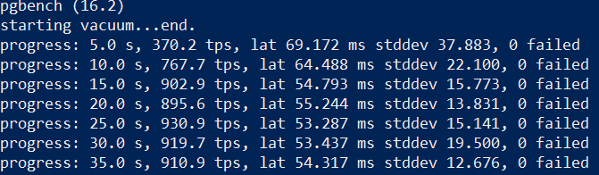

#### Сценарий 2

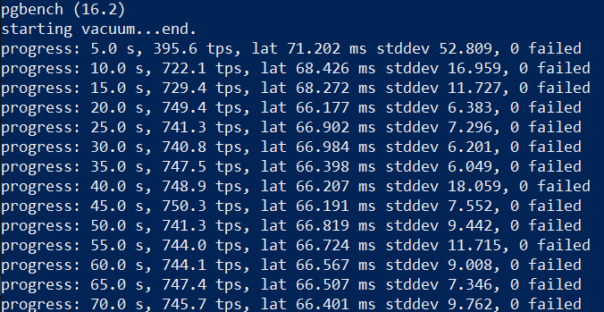

#### Сценарий 3

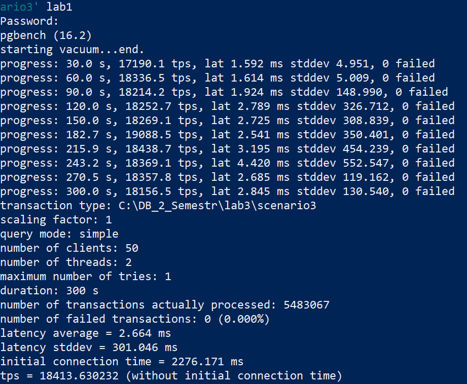

#### Добавил обычные B-tree индексы для сценария 1
```sql
CREATE INDEX idx_retail_price ON goods (retail_price);
CREATE INDEX idx_wholesale_price ON goods (wholesale_price);
```
Тестируем:

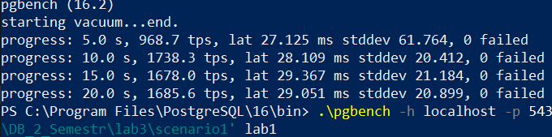

#### Добавил функциональные B-tree индексы для сценария 1
```sql
create index ix_upper_name on goods (upper(name));  
create index ix_upper_description on goods (UPPER(description));
```

Тестируем

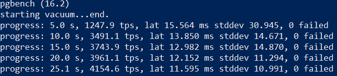

#### Добавил условный B-Tree индекс
```sql
CREATE INDEX idx_retail_price ON goods (retail_price)
where retail_price < 2000;
CREATE INDEX idx_wholesale_price ON goods (wholesale_price)
where wholesale_price > 500;
```

Тестируем

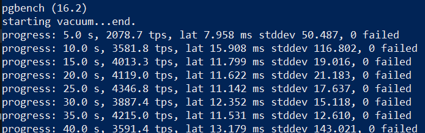

## Сценарий 2

#### Добавил Включенный B-tree индекс
```sql
create index ix_include_name on goods (retail_price, wholesale_price) include (name);
create index ix_include_description on goods (retail_price, wholesale_price) include (description);
```

Тестируем

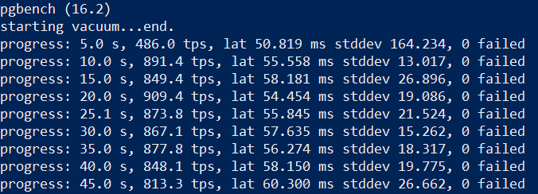


### Добавил обычные B-tree индексы для сценария 2
```sql
CREATE INDEX ix_scenario1_phone_number ON customers(phone_number);
create index ix_scenario2_id on customers(customer_id);
create index ix_scenario3_goods_id on goods(goods_id);
create index ix_scenario3_deals_id on deals(id);
```

 ### протестируем сценарий 2
 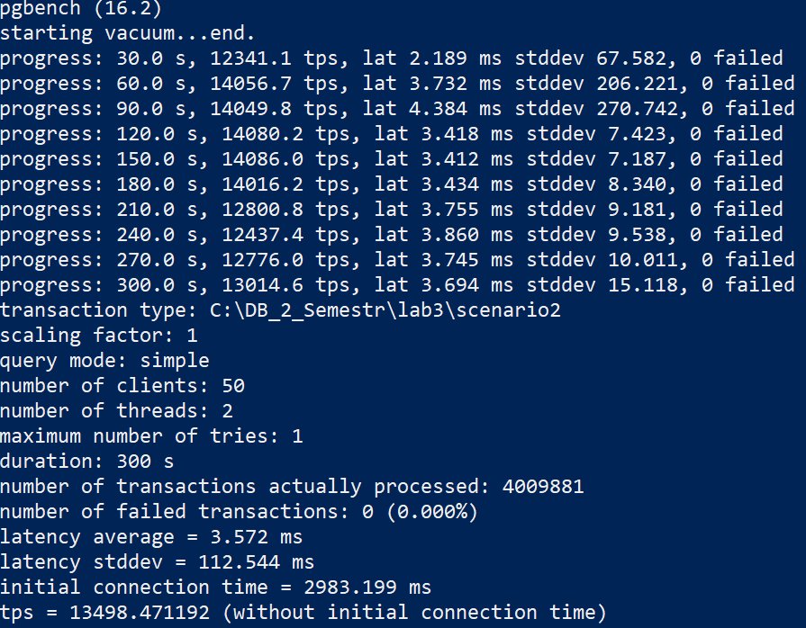

 #### __На скриншоте видно, что tps незначительно упал, относительно тестирования сценария без индексов, однако это произошло из-за того, что я отключил ноутбук от питания, что повлияло на скорость работы процессора, а соответственно и на tps.__


### Удалим все индексы
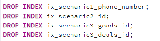

### Теперь запущу тестирование повторно, чтобы доказать вышесказанное.
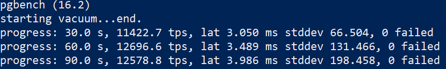

#### tps без индексов, при ограниченной работе процессора упал еще сильнее.


#### Создадим функциональные индексы 

```sql
create index ix_retail_price on goods (UPPER(retail_price));
create index ix_deals_quantity on deals(UPPER(quantity));
```


Тестируем 

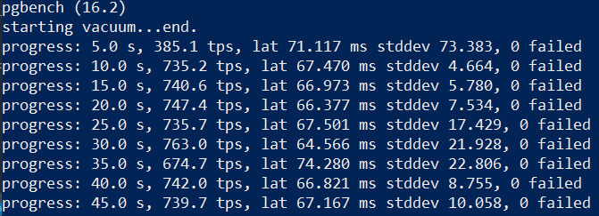


#### Создадим условные индексы


```sql
create index ix_retail_price on goods (goods_id) where retail_price > 100.0;
CREATE INDEX ix ON goods (name, description, retail_price)
WHERE retail_price > 0.5;
```

тестируем

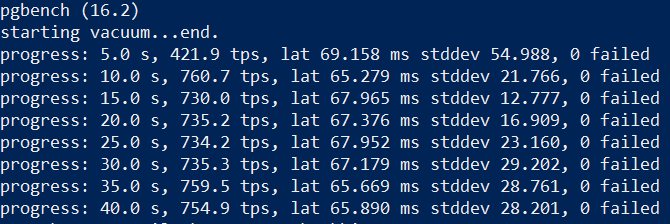


#### Создадим Включённый B-Tree индекс

```sql
create index ix1 on goods (retail_price) include (goods_id);
create index ix2 on goods (retail_price) include (name, description, retail_price);
```

Тестируем

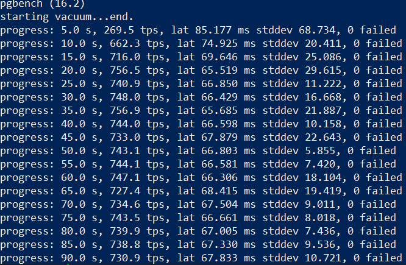

## Сценарий 3

#### Добавил обычные B-tree индексы

```sql
create index ix1 on goods (goods_id);
```

Тестируем

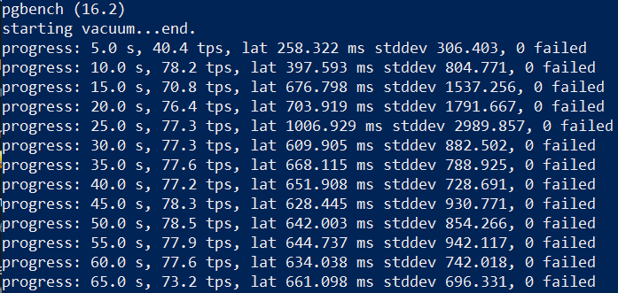

#### Создадим функциональные индексы 

```sql
create index ix1 on goods (Upper(name));
```

Тестируем

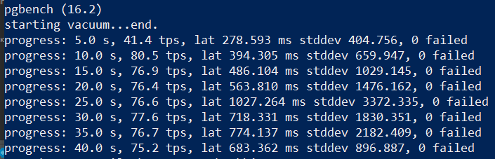

#### Создадим условные индексы

```sql
CREATE INDEX idx_name_upper ON goods (UPPER(name)) WHERE UPPER(name) != 'LAPTOP';
CREATE INDEX idx_goods_id_gt ON goods (goods_id) WHERE goods_id > 500;
CREATE INDEX idx_goods_id_eq ON goods (goods_id) WHERE goods_id = 330;
CREATE INDEX idx_goods_id_lt ON goods (goods_id) WHERE goods_id < 40;
CREATE INDEX idx_goods_id_lt2 ON goods (goods_id) WHERE goods_id < 150;
```

Тестируем

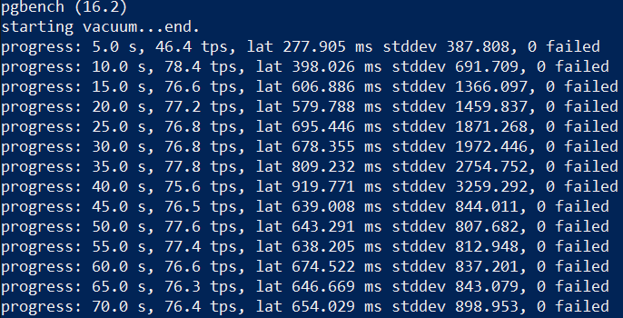

#### Добавил Включенный B-tree индекс

```sql
CREATE INDEX idx_retail_price ON goods (retail_price) INCLUDE (name);
```

Тестируем

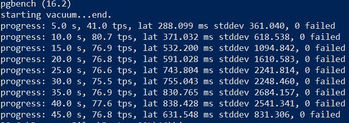

### Вывод:

Несмотря на добавление индексов в некоторорых случаях tps транзакций оставался таким же или вовсе понижался, это может быть связано с несколькими причинами:
Неподходящий выбор индексов: Некорректно выбранные или избыточные индексы могут увеличить накладные расходы на обслуживание индексов.

Недостаточная статистика или устаревшие данные: Отсутствие актуальной статистики о данных в таблицах может привести к неоптимальным планам выполнения запросов.

Проблемы с конфигурацией СУБД: Некорректная конфигурация базы данных или параметров СУБД может замедлить производительность.

Чрезмерная фрагментация индексов: Частые операции вставки, обновления или удаления данных могут привести к фрагментации индексов.

Проблемы с аппаратной инфраструктурой: Недостаточные ресурсы сервера (процессор, память, дисковое пространство) могут быть причиной ухудшения производительности.

Также на личном опыте осознал, как питание процессора влияет на tps.