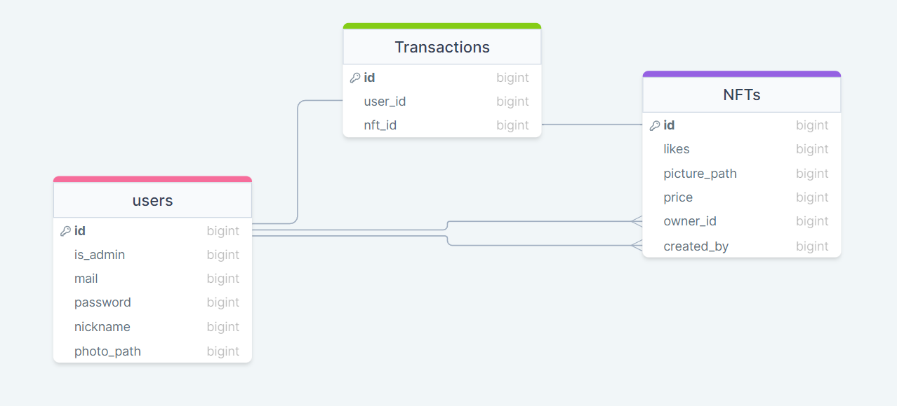

# Лабораторная работа 7

### База данных: Магазин NFT

концептульная схема

#### Реализуем данную БД NFT в виде EAV (Entity-Attribute-Value) модели

1. **EAV_Metadata (Метаданные EAV):**
   - **entity_id**: Уникальный идентификатор сущности (NFT-картинки).
   - **attribute_name**: Название атрибута.
   - **attribute_value**: Значение атрибута.
   - **timestamp**: Временная метка изменения атрибута.

2. **Users (Пользователи):**
   - **user_id**: Уникальный идентификатор пользователя.
   - **username**: Имя пользователя.
   - **email**: Email пользователя.
   - **registration_date**: Дата регистрации.

3. **NFTs (NFT-картинки):**
   - **nft_id**: Уникальный идентификатор NFT-картинки.
   - **owner_id**: Ссылка на владельца NFT (связь с таблицей Users).
   - *Дополнительные атрибуты храниться в EAV_Metadata сущности NFT.

### Модель для временного отслеживания изменений:

4. **Transactions (История пользовательских действий):**
   - **record_id**: Уникальный идентификатор записи истории.
   - **user_id**: Ссылка на пользователя (связь с таблицей Users).
   - **action_description**: Описание действия.
   - **action_date**: Дата действия.
   - **start_validity_time**: Время начала действия.
   - **end_validity_time**: Время окончания действия.

### Связи и особенности:
- **NFTs <-> EAV_Metadata**: Сущность NFT-картинки связана с метаданными для хранения дополнительных атрибутов.
- **Users <-> UserHistory**: История действий связана с конкретными пользователями для отслеживания изменений во времени.

Реализация:
Используем EAV_Metadata для динамического хранения атрибутов NFT-картинок, таких как художник, год создания и т.д. Transactions будет содержать записи о действиях пользователей, таких как покупки и продажи NFT-картинок, с указанием времени начала и окончания действий. Такая структура базы данных, комбинирующая EAV для гибкого хранения дополнительных атрибутов и временную модель для отслеживания изменений, позволит эффективно управлять данными и действиями в проекте с учетом динамических атрибутов и изменений во времени.