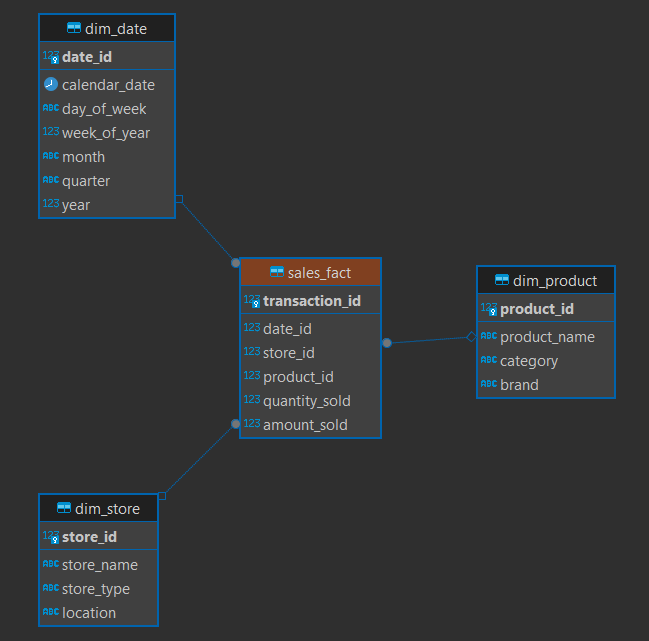
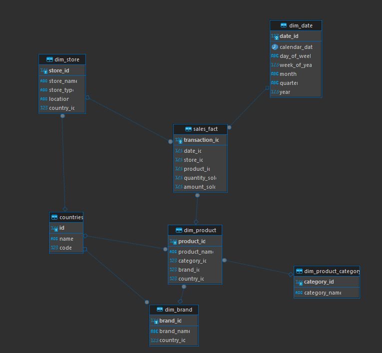

# Лабораторная работа 8
## Даукаев Камиль. Вариант 2. Группа 11-208.

# Сущности базы данных "Продажа комплектующих изделий"

## Таблица Фактов (Sales_Fact)

- transaction_id (идентификатор транзакции, первичный ключ)

- date_id (идентификатор даты продажи, внешний ключ к таблице Dim_Date)

- store_id (идентификатор магазина, внешний ключ к таблице Dim_Store)

- product_id (идентификатор продукта, внешний ключ к таблице Dim_Product)

- quantity_sold (количество проданных единиц)

- amount_sold (сумма продажи)

## Измерения

### Таблица Dim_Date (Информация о датах)

- date_id (идентификатор даты, первичный ключ)

- calendar_date (календарная дата)

- day_of_week (день недели)

- week_of_year (номер недели в году)

- month (месяц)

- quarter (квартал)

- year (год)

### Таблица Dim_Store (Информация о магазинах)

- store_id (идентификатор магазина, первичный ключ)

- store_name (название магазина)

- store_type (тип магазина: супермаркет, магазин у дороги и т. д.)

- location (местоположение магазина: город, штат и т. д.)

### Таблица Dim_Product (Информация о продуктах)

- product_id (идентификатор продукта, первичный ключ)

- product_name (название продукта)

- category (категория продукта: напитки, продукты питания и т. д.)

- brand (бренд продукта)


## 1. Составим ROLAP схему типа звезда для описанной базы данных.



### Физическая модель

```sql
CREATE TABLE Dim_Date (
    date_id SERIAL PRIMARY KEY,
    calendar_date DATE NOT NULL,
    day_of_week VARCHAR(20),
    week_of_year INTEGER,
    month VARCHAR(20),
    quarter VARCHAR(10),
    year INTEGER,
    UNIQUE (calendar_date)
);

CREATE TABLE Dim_Store (
    store_id SERIAL PRIMARY KEY,
    store_name VARCHAR(100) NOT NULL,
    store_type VARCHAR(50),
    location VARCHAR(100),
    UNIQUE (store_name)
);

CREATE TABLE Dim_Product (
    product_id SERIAL PRIMARY KEY,
    product_name VARCHAR(100) NOT NULL,
    category VARCHAR(50),
    brand VARCHAR(50),
    UNIQUE (product_name)
);

CREATE TABLE Sales_Fact (
    transaction_id SERIAL PRIMARY KEY,
    date_id INTEGER REFERENCES Dim_Date(date_id),
    store_id INTEGER REFERENCES Dim_Store(store_id),
    product_id INTEGER REFERENCES Dim_Product(product_id),
    quantity_sold INTEGER,
    amount_sold NUMERIC(12, 2),
    FOREIGN KEY (date_id) REFERENCES Dim_Date(date_id),
    FOREIGN KEY (store_id) REFERENCES Dim_Store(store_id),
    FOREIGN KEY (product_id) REFERENCES Dim_Product(product_id)
);
```


## Перейдем от звезды к снежинке

Нормализовав таблицу и добавив связи между вторичными таблицами получим данную модель бд соответствующую схеме снежинки:



```sql
-- Создание таблицы Dim_Date для хранения информации о датах
CREATE TABLE Dim_Date (
    date_id SERIAL PRIMARY KEY,
    calendar_date DATE NOT NULL,
    day_of_week VARCHAR(20),
    week_of_year INTEGER,
    month VARCHAR(20),
    quarter VARCHAR(10),
    year INTEGER,
    UNIQUE (calendar_date)
);

create table countries(
	id serial primary key,
	name varchar,
	code int
);

-- Создание таблицы Dim_Store для хранения информации о магазинах
CREATE TABLE Dim_Store (
    store_id SERIAL PRIMARY KEY,
    store_name VARCHAR(100) NOT NULL,
    store_type VARCHAR(50),
    location VARCHAR(100),
    UNIQUE (store_name),
    country_id integer references countries(id)
);

-- Создание таблицы Dim_Product_Category для хранения категорий продуктов
CREATE TABLE Dim_Product_Category (
    category_id SERIAL PRIMARY KEY,
    category_name VARCHAR(50) NOT NULL,
    UNIQUE (category_name)
);

-- Создание таблицы Dim_Brand для хранения информации о брендах продуктов
CREATE TABLE Dim_Brand (
    brand_id SERIAL PRIMARY KEY,
    brand_name VARCHAR(50) NOT NULL,
    UNIQUE (brand_name),
    country_id integer references countries(id)
);

-- Создание таблицы Dim_Product для хранения информации о продуктах
CREATE TABLE Dim_Product (
    product_id SERIAL PRIMARY KEY,
    product_name VARCHAR(100) NOT NULL,
    category_id INTEGER REFERENCES Dim_Product_Category(category_id),
    brand_id INTEGER REFERENCES Dim_Brand(brand_id),
    UNIQUE (product_name),
    country_id integer references countries(id)
);

-- Создание таблицы Sales_Fact для хранения фактов о продажах
CREATE TABLE Sales_Fact (
    transaction_id SERIAL PRIMARY KEY,
    date_id INTEGER REFERENCES Dim_Date(date_id),
    store_id INTEGER REFERENCES Dim_Store(store_id),
    product_id INTEGER REFERENCES Dim_Product(product_id),
    quantity_sold INTEGER,
    amount_sold NUMERIC(12, 2)
);
```

## Вставим данные в получившуюся таблицу:

```sql
-- Вставка данных в таблицу Dim_Date
INSERT INTO Dim_Date (calendar_date, day_of_week, week_of_year, month, quarter, year)
VALUES
    ('2024-01-01', 'Monday', 1, 'January', 'Q1', 2024),
    ('2024-02-15', 'Thursday', 7, 'February', 'Q1', 2024),
    ('2024-03-10', 'Saturday', 10, 'March', 'Q1', 2024),
    ('2024-04-25', 'Thursday', 17, 'April', 'Q2', 2024),
    ('2024-05-03', 'Friday', 18, 'May', 'Q2', 2024),
    ('2024-06-12', 'Wednesday', 24, 'June', 'Q2', 2024),
    ('2024-07-04', 'Thursday', 27, 'July', 'Q3', 2024),
    ('2024-08-20', 'Tuesday', 34, 'August', 'Q3', 2024),
    ('2024-09-15', 'Sunday', 37, 'September', 'Q3', 2024),
    ('2024-10-30', 'Wednesday', 44, 'October', 'Q4', 2024);

-- Вставка данных в таблицу countries
INSERT INTO countries (name, code)
VALUES
    ('USA', 1),
    ('Canada', 2),
    ('UK', 3),
    ('France', 4),
    ('Germany', 5),
    ('Japan', 6),
    ('Australia', 7),
    ('Brazil', 8),
    ('India', 9),
    ('China', 10);

-- Вставка данных в таблицу Dim_Store
INSERT INTO Dim_Store (store_name, store_type, location, country_id)
VALUES
    ('SuperMart', 'Supermarket', 'New York', 1),
    ('Local Grocery', 'Grocery Store', 'Toronto', 2),
    ('Big Mall', 'Shopping Mall', 'London', 3),
    ('Corner Store', 'Convenience Store', 'Paris', 4),
    ('City Market', 'Market', 'Berlin', 5),
    ('Tokyo Plaza', 'Shopping Center', 'Tokyo', 6),
    ('Down Under Mart', 'Retail Store', 'Sydney', 7),
    ('Rio Shop', 'Boutique', 'Rio de Janeiro', 8),
    ('Mumbai Mart', 'Supermarket', 'Mumbai', 9),
    ('Shanghai Central', 'Shopping Mall', 'Shanghai', 10);

-- Вставка данных в таблицу Dim_Product_Category
INSERT INTO Dim_Product_Category (category_name)
VALUES
    ('Electronics'),
    ('Clothing'),
    ('Food & Beverage'),
    ('Home & Garden'),
    ('Health & Beauty'),
    ('Sports & Outdoors'),
    ('Toys & Games'),
    ('Books'),
    ('Office Supplies'),
    ('Automotive');

-- Вставка данных в таблицу Dim_Brand
INSERT INTO Dim_Brand (brand_name, country_id)
VALUES
    ('Samsung', 1),
    ('Nike', 2),
    ('Coca-Cola', 3),
    ('IKEA', 4),
    ('LOréal', 5),
    ('Adidas', 6),
    ('LEGO', 7),
    ('Amazon', 8),
    ('Toyota', 9),
    ('Huawei', 10);

-- Вставка данных в таблицу Dim_Product
INSERT INTO Dim_Product (product_name, category_id, brand_id, country_id)
VALUES
    ('Samsung Galaxy S21', 1, 1, 1),
    ('Nike Air Max', 2, 2, 2),
    ('Coca-Cola Classic', 3, 3, 3),
    ('IKEA Hemnes Bed', 4, 4, 4),
    ('LOréal Paris Shampoo', 5, 5, 5),
    ('Adidas UltraBoost Shoes', 6, 6, 6),
    ('LEGO Star Wars Set', 7, 7, 7),
    ('Amazon Echo Dot', 8, 8, 8),
    ('Toyota Camry', 9, 9, 9),
    ('Huawei P40 Pro', 1, 10, 10);

-- Вставка данных в таблицу Sales_Fact
INSERT INTO Sales_Fact (date_id, store_id, product_id, quantity_sold, amount_sold)
VALUES
    (1, 1, 1, 100, 5000.00),
    (2, 2, 2, 50, 2500.00),
    (3, 3, 3, 200, 1000.00),
    (4, 4, 4, 20, 1500.00),
    (5, 5, 5, 80, 800.00),
    (6, 6, 6, 150, 3000.00),
    (7, 7, 7, 300, 2000.00),
    (8, 8, 8, 40, 400.00),
    (9, 9, 9, 120, 12000.00),
    (10, 10, 10, 70, 7000.00);
```


Общая сумма продаж по категориям продуктов за определенный период времени
```sql
SELECT pc.category_name, SUM(sf.amount_sold) AS total_sales
FROM Sales_Fact sf
JOIN Dim_Product dp ON sf.product_id = dp.product_id
JOIN Dim_Product_Category pc ON dp.category_id = pc.category_id
JOIN Dim_Date d ON sf.date_id = d.date_id
WHERE d.calendar_date BETWEEN '2024-01-01' AND '2024-03-31'
GROUP BY pc.category_name
ORDER BY total_sales DESC;
```

Топ-5 продуктов по количеству продаж за последний месяц

```sql
SELECT dp.product_name, SUM(sf.quantity_sold) AS total_quantity_sold
FROM Sales_Fact sf
JOIN Dim_Product dp ON sf.product_id = dp.product_id
JOIN Dim_Date d ON sf.date_id = d.date_id
WHERE d.calendar_date >= (SELECT MAX(calendar_date) FROM Dim_Date)
GROUP BY dp.product_name
ORDER BY total_quantity_sold DESC
LIMIT 5;
```

Средний чек покупки по типам магазинов
```sql
SELECT ds.store_type, AVG(sf.amount_sold) AS avg_transaction_amount
FROM Sales_Fact sf
JOIN Dim_Store ds ON sf.store_id = ds.store_id
GROUP BY ds.store_type
ORDER BY avg_transaction_amount DESC;
```

Общая сумма продаж по странам за текущий год
```sql
SELECT c.name AS country_name, SUM(sf.amount_sold) AS total_sales
FROM Sales_Fact sf
JOIN Dim_Store ds ON sf.store_id = ds.store_id
JOIN countries c ON ds.country_id = c.id
JOIN Dim_Date d ON sf.date_id = d.date_id
WHERE d.year = EXTRACT(YEAR FROM CURRENT_DATE)
GROUP BY c.name
ORDER BY total_sales DESC;
```
