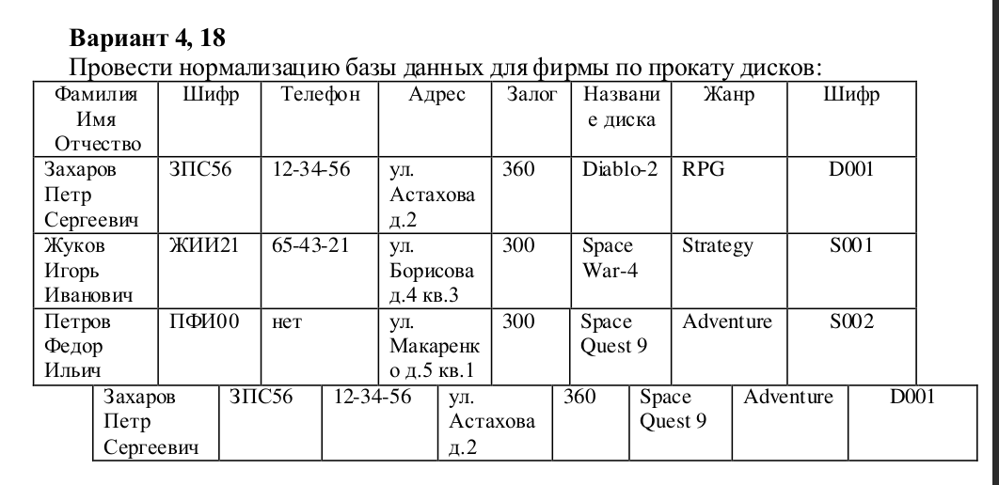

### Лабораторная работа 2
## Нормализация БД
Дано отношение:




# Для удобства переписываю на postgreSQL, полученный скрипт:
```sql
create table main(
	fio varchar,
	customer_code varchar,
	number varchar CHECK (number ~ '^\d{2}-\d{2}-\d{2}$'),
	address varchar,
	pledge int check ( pledge > 0),
	disk_name varchar,
	genre varchar,
	transaction_code varchar
);


insert into main 
values ( 'Захаров Петр Сергеевич', 'ЗПС56', '12-34-56', 'ул.Астахова д.2', 360, 'Diablo-2', 'RPG', 'D001' ),
	('Жуков Игорь Иванович', 'ЖИИ21', '65-43-21', 'ул.Борисова д.4 кв.3', 300, 'Space War-4', 'Strategy', 'S001'),
	('Петров Федор Ильич', 'ПФИ00', null, 'ул.Макаренко д.5 кв.1', 300, 'Space Quest 9', 'Adventure', 'S002'),
	('Захаров Петр Сергеевич', 'ЗПС56', '12-34-56', 'ул.Астахова д.2',  360, 'Space Quest 9', 'Adventure', 'D001');
```

## 1 НФ
Все ячейки таблицы должны содержать атомарные (неделимые) значения.

Я думаю, что моя таблица уже находится в 1 НФ, так как все её значения простые.

## 2 НФ
Отношение находится во 2НФ, если оно находится в 1НФ и каждый не ключевой атрибут неприводимо зависит от Первичного Ключа(ПК).

# В моём варианте лабораторной всего __4__ обьекта
# поэтому провести точный анализ очень сложно, на основе предоставленных обьектов я просто обьединю два атрибута шифра в один


# Выпишем функциональные зависимости:
Имя, название диска -> все остальные(неключенвые) атрибуты.

**При этом некоторые атрибуты зависят не от всего ключа в целом:**
шифр покупателя(2 колонки) -> Телефон, Адрес, имя
Название диска> Жанр

Выделим неполные зависимости в отдельные отношения. Если какие-то атрибуты зависят от одной части ключа, объединяем их в одну таблицу.

Первое отношение: __шифр покупателя__ -> Телефон, Адрес, Имя
Второе отношение: __Название диска__ -> Жанр

Реализуем это в PostgreSQL

```sql
alter table main  drop column number;
alter table main  drop column address;
alter table main drop column fio;

create table customer(
	id varchar primary key,
	number varchar CHECK (number ~ '^\d{2}-\d{2}-\d{2}$'),
	address varchar,
	fio varchar
);


alter table main drop column genre;

create table game(
	disk_name varchar primary key,
	genre varchar
);
```

и добавим связь между нашей главной и только что созданными таблицами

```sql
    alter table main  add foreign key (customer_code) references customer;
    alter table main add foreign key (disk_name) references game;
```
Сейчас по сути, первая и главная таблица является вспомогательной таблицой, в отношении Многие ко Многим между таблицами game и customer


Теперь у нас остался лишь 1 атрибут - Залог(pledge).
Неключевой атрибут pledge зависит от ключа КС, КЭ в целом, а не от его части. Значит, это отношение находится в 2НФ.

## 3 НФ
Отношение находится в 3НФ, когда находится во 2НФ и каждый не ключевой атрибут нетранзитивно зависит от первичного ключа. 

Ни одна из зависимостей во всех 3 таблицах не является транзитивной, поэтому данная бд в 3 нф.


<!-- 
# Выпишем функциональные зависимости:
Имя, код транзакции -> все остальные (неключевые)атрибуты.

**При этом некоторые атрибуты зависят не от всего ключа в целом:**
Имя -> Телефон, Адрес, шифр покупателя
код транзакции(видимо код аренды) -> Диск,жанр, залог

Выделим неполные зависимости в отдельные отношения. Если какие-то атрибуты зависят от одной части ключа, объединяем их в одну таблицу.

Первое отношение: Имя(PK) -> Телефон, Адрес, шифр покупателя
И второе: Код транзакции(PK) -> Диск,жанр, залог -->

